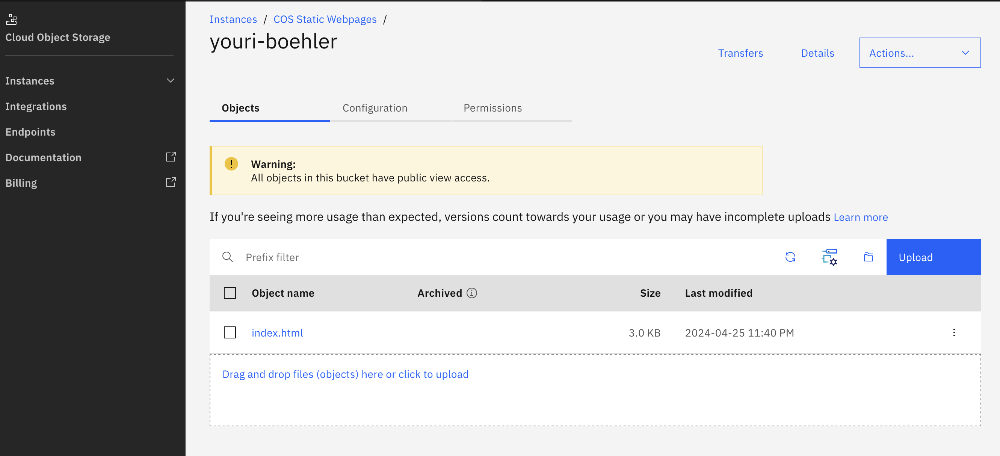

# Create Web Page in Object Storage

The following steps can be followed in order to serve a static Web page through placing a file / files in Cloud Object Storage on IBM Cloud.

## Step 1: Create a Cloud Object Storage (COS) instance
1. Login to [IBM Cloud](https://cloud.ibm.com/login) 
2. If not done already, create a [Cloud Object Storage (COS)](https://cloud.ibm.com/objectstorage) instance withe the named "**COS Static Webpages**"

## Step 2: Create a COS bucket and upload a file

1.  In the resource list under "Storage" select the Cloud Object Storage named "**COS Static Webpages**"
2.  In the Overview section, click "**Create bucket**" to create a new bucket.
3.  From the selection choose "**Host a static website**"
4.  Enter a "**unique bucket name**" with your first- and family name (eg. youri-boehler)
5.  **Enable public access** and confirm
6.  Click on "**Next**"
7.  Upload an index.html file. You might want to take this one: [index.html](index.html)
8.  Press "**Next**"
9. Skip the "**Test your bucket**" section and press "**View bucket configuration**"

## Step 3: View the content in a browser

In the list of object in the bucket, select the index.html to show its details. In the details Overview tab copy the public URL for the object.

You can open this URL and access the file's content in any browser.

## Next Steps

You might want to update index.html and add additional files to enhance your public Web site.
